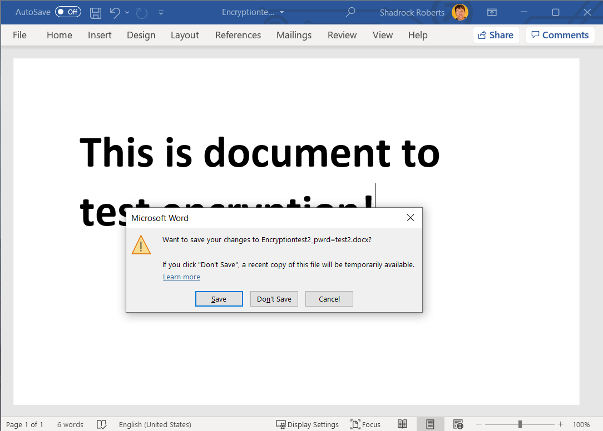

# Section Title
This section addresses a basic use-case for encrypting a file. There are a range of factors to consider when encrypting a file, but here we focus on using a password and encryption of a single file. See the links below for resources that explore encryption in more depth.

*What's the difference between password protection and encryption?*
Think of password protection as a box with a lock on it. When you "password protection" your document you are putting it in an electronic box and locking it: only those with the password can open the box. However, if the password you choose is not very strong, or if it is shared indiscriminantly, someone can easily get into the box and view your document! By contrast, encryption uses complex algorithms to encode information, which requires having a key to decrypt it. Think of this as taking your document and running it through a paper shredder that assigns a special key to put the document back together again. When you combine password protection and encryption, you are effectively doubling your protection. If someone successfully breaks the password to the electronic box, they will only be able to see the bits of shredded paper without also having the proper key. All Mercy Corps' laptops are encrypted using Microsoft BitLocker. This prevents a Mercy Corps laptop hard disks from being removed and accessed on another computer.

## Importance
Encryption is important because it helps ensure the privacy and security of information. Without encryption, data can be intercepted and read by anyone who has access to it. When considering whether or not to encrypt data, ask yourself, "What is the risk to Mercy Corps' program participants, staff, and partners if these data were lost of stolen?" A good rule of thumb is to encrypt anything containing personally identifiable or sensitive information.

## Principles
- "Use vetted organizational systems for encrypted data transfer and storage (for example, Microsoft SharePoint for file transfer instead of third-party file-sharing programs)." - **from Linda**
- Encrypt sensitive data at all stages of its collection, use, transmission, and storage.
- Use strong passwords, consider using a password manager, and do not re-use passwords; lists of passwords circulate online and make it easier for someone with one of your passwords to access more than one of your accounts or files!
- In a team environment, encryption is only as good as the weakest link. If even one person fails to use encryption, your program data is at risk. "This means that encryption is not just a question of technology: it requires a commitment to changing behaviors as well."  - **from Linda**
- Understand laws that govern encryption in your country. Local laws in a number of countries (such as Sudan, Yemen and Pakistan) place limits
on encryption software.

## Instructions or Guidance
As needed per section.
Basic password encryption in Windows 10: https://support.microsoft.com/en-us/office/protect-a-document-with-a-password-05084cc3-300d-4c1a-8416-38d3e37d6826
1. Open the Word, Excel, or PowerPoint file you want to encrypt and select the `File` menu.

2. Navigate to `Info` > `Protect Document` > `Encrypt with Password`.

3. Type a password, click `OK` then type it again to confirm it.

4. Save the file to make sure the password takes effect.

Now you can share the file and the password with those who require access. It is best practice to place the file on a Mercy Corps approved cloud service such as Gsuite or OneDrive. Remember to send the link to the file and the password to the file separately. For example, you could share the file using Google Drive [see instructions here - *add link*](link.com) and generate a notice that the file has been shared via Google, then share the password via an email to a colleague. 

## Further Assistance
- The Electronic Cash Transfer Learning Action Network's [Data Starter Kit](https://www.calpnetwork.org/wp-content/uploads/2020/06/DataStarterKitforFieldStaffELAN.pdf) provides a tip sheet for encryption (see Tip sheet #5).
- The Electronic Frontier Foundation provides a more [detailed look at various forms of encryption here](https://ssd.eff.org/en/module/what-should-i-know-about-encryption).
- The Engine Room's [Hand-Book of the Modern Development Specialist includes a section on Managing Data](https://the-engine-room.github.io/responsible-data-handbook/) that provides additional, high-level, thoughts on encryption.
