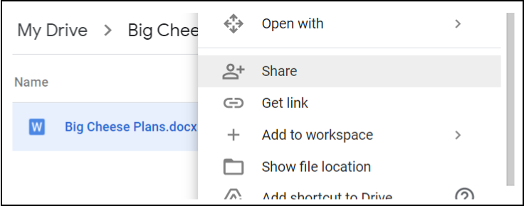
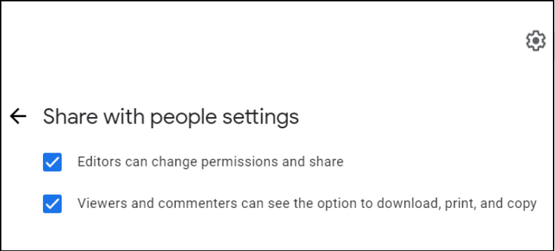

# File Sharing: GDrive
Here is a sample use-case for sharing a file, using best practices in Gdrive. Imagine that Mercy Corps is working with a consultant (PNW Rocks), to create materials for a major new initiative at Mercy Corps, code-named Big Cheese. The Big Cheese project will not be announced publicly until July 2021. It is time to collaborate on next steps for the project, in a file called Big Cheese Plans.

## Step 1 - Upload
Upload the file to My Drive.

## Step 2 - Share
To share the file, right-click it and then click `Share`.

  - Only give access to those who need the file. When you share a file in My Drive, the default setting is `Restricted` (to persons or groups), which is the best practice. Remember, confidential, private or personally identifiable information (PII) content should *always* have restricted access!
  - The `Anyone with the link` option should only be used for files that hold no confidential information, and are open to the public. If the `Anyone with the link` setting was used on a file with confidential private, personal or financial data, it could put Mercy Corps at immediate legal risk, and make it easy for bad actors to use that information for criminal purposes.

## Step 3 - Select level of access
Enter the email address address for the person you want to share with, then choose the level of access. Google defaults to `Editor` access, which is only appropriate for team members who need full access to the dcocument. When you are engaging stakeholders for feedback, choose `Viewer` or `Commenter`. Best practice is to notify the person, and add a message, explaining why you’ve shared the file. To notify, leave that box checked. When done with changes, click `Send`.

Another option is to send a separate email with a link to the file. To notify separately via email, uncheck the `Notify people` box. After clicking `Done`,  right click the file and choose `Get Link`. In the new popup window, click the `Copy link` button, and paste it into your email.

- To learn more about access levels, visit [Share and collaborate in My Drive](https://support.google.com/a/users/answer/9310248?hl=en).
- If you restricted a file, and someone with access shares the link with another person, that person will not automatically have access to that content in Google Drive. Instead, they’ll see a web page with the opportunity to request access. The request for access will go to the file owner. Access requests should be reviewed, and those receiving access requests should not simply grant permission to any and all requests, without reviewing the above notes and considerations.

## Step 4 - Temporary Access
Once permission has been granted, the sharing time period can be shortened. To limit access, right click the file again, and click `Share`. Find the email address you just shared with and right click the access level. You will see new options appear, so click on `Give temporary access`.

A calendar will appear. Navigate to the month when access should expire, and click the corresponding date.

The calendar will disappear, and the display date will change. Once you can see that access will expire on the correct date, click Save.

## Step 5 - Additional Options
If you have concerns about others taking inappropriate actions with the content, there are additional options from the settings screen. File settings can be accessed from the gear icon in the upper right of the sharing window. Click the gear and you’ll see options to restrict further sharing, or disabling the option to download, print or copy. For any feature you want to disable, simply uncheck the box. The file will quickly update, saving the new setting.

- To learn more, visit [Restrict sharing options on Drive](https://support.google.com/a/users/answer/9308868?hl=en).

### Additional considerations
  - Do not place confidential files inside folders that are shared widely. Shared folders permissions trickle down to each file and subfolder, so your confidential file could be accessed by anyone with permission to the parent folder! Instead, move your confidential file to a new location, outside the larger shared folder structure.
  - Once a file has been shared, you may have the option to `Make a Copy` and/or `Move` the file to another location. Never move a file without the owner’s permission!
  - If you need to see the file in your My Drive or in a secondary location, the best practice is to use the [Add shortcut to Drive](https://support.google.com/drive/answer/9700156?hl=en&co=GENIE.Platform%3DDesktop) option.
  - If a file copy is made, or the file is moved, be aware it will not have the same permissions as the original file unless you explicitly set those permissions.
  
## Further Assistance
This document will not cover file sharing in Google’s shared drives, nor external file sharing platforms. To learn more about these, visit Google’s [Best practices for shared drives](https://support.google.com/a/users/answer/9310352?hl=en) or [managing shared drives page](https://support.google.com/a/topic/7337266?hl=en&ref_topic=2490075). Each of these pages is available in a variety of languages: scroll to the bottom of the page to select your language.

The best way to control access to files using Drive is to create a Google group and assign permissions to those in the group. Google groups are not just for sending emails; groups are powerful and convenient tools for managing folder and file permissions. [Find out more about Google Groups here](https://support.google.com/groups/?hl=en#topic=9216).

If your project requires the use of applications outside of G Suite, encourage your team to download [Google Drive for desktop](https://support.google.com/drive/answer/7329379?hl=en). This program allows you to view any documents in My Drive or Shared drives as if they were on your laptop, even when offline, and without having to download the item or convert it to a Google format.
