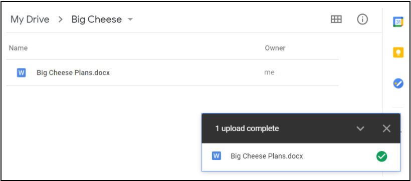

*Tasks to finish this section:*
- [ ] Edit text - this draft still needs to be shortened up: make the principles more direct and consolidated. Anything GDrive specific should go in instructions.
- [ ] Clear on text
- [ ] Link to other assets that are part of the section (e.g. instructions, video, or translations)
- [ ] Link to guidance video - **there are millions of these online already: should we just pick one on Vimeo and YouTube (diff platforms are banned in some countries) instead of paying for something new?**
- [ ] Delete this list!

# File Sharing Best Practices: Gsuite
This section will cover file sharing best practices for Mercy Corps team members using G Suite apps, particularly Gmail and Google My Drive. To simplify this guide, we will be discussing sharing a single *file*, such as a spreadsheet. However, the same options are available when sharing a My Drive *folder*.

Note: Mercy Corps is transitioning to Microsoft 365 for file sharing. A similar document or resource will be created to describe best practices particular to that platform.

## Importance
There are several reasons why it is better to share a file by hosting it in Google Drive and sending a link rather than as an attachment in an email.
- **Security**: you can easily change who is permitted to access or edit your file. You can also make the link time sensitive by only allowing access to the file for a given period of time.
- **Version control**: when sharing a file that is hosted online, many people can access it at once and all changes and comments will stay in one file. Sending a file as an attachment often results in multiple versions of the same document with different file names, edits, comments, etc. The document owner will spend a lot of time trying to compile all of this into a single file! Using a link also guarantees that the recipients always have access to the most updated version of the document.
- **File sizes**: Some IT departments impose restrictions on the size of attachment that are allowed. Sending a link allows you to share files of any size.
- **Easy editing**: Files shared as Google documents in Drive, Microsoft Word in OneDrive, or similar formats allow the recipient to open and interact with the document using a web browser: they do not have to have the most recent version of a particular type of software.

## Principles
Whenever you share documents, you should consider the following:
- **Carefully consider who will access the file.**
  - Only give access to those who need the file. When you share a file in My Drive, the default setting is `Restricted` (to persons or groups),
and that is the best practice.
  - Confidential, private or personally identifiable information (PII) content should *always* have restricted access. Note: if you are unable to determine if or how the content should be restricted, please seek assistance from Legal or the Data Protection and Privacy team.
  - The `Anyone with the link` option should only be used for files that hold no confidential information, and are open to the public. If the `Anyone with the link` setting was used on a file with confidential private, personal or financial data, it could put Mercy Corps at immediate legal risk, and make it easy for bad actors to use that information for criminal purposes.
- **Use the appropriate level of permissions.**
  - Example: a new project charter needs to be created. It’s likely only the team responsible for charter creation should have `Editor` access.
  - When it’s time to get feedback from others, grant `Viewer` or `Commenter` permission to those individuals, based on the level of interaction you expect or need.
  - To learn more about access levels, visit [Share and collaborate in My Drive](https://support.google.com/a/users/answer/9310248?hl=en). You can also restrict the ability for others to download a file, or share it with others. To learn more, visit [Restrict sharing options on Drive](https://support.google.com/a/users/answer/9308868?hl=en).
  - If you restricted a file, and someone with access shares the link with another person, that person will not automatically have access to that content in Google Drive. Instead, they’ll see a web page with the opportunity to request access. The request for access will go to the file owner. Access requests should be reviewed, and those receiving access requests should not simply grant permission to any and all requests, without reviewing the above notes and considerations.
  - Use caution in granting access requests to team members who may accidentally be using their personal email accounts. Instead of granting access to a personal email account, ask the team member to log into Google using their Mercy Corps account.
- **Permissions change over time**
  - If you are only working with someone for a short period of time or with people outside Mercy Corps, consider giving temporary permissions by adding an expiration date to their access. If you forget to remove the access later, an expiration date will ensure their access is suspended at the right time.
  - Consider restricting whether people have the ability to edit permissions on the file, download, print or copy the file.
  - Periodically audit the list of who has access to your files, folders or Shared drives. A regular review of file/folder permissions will ensure you remove access for team members who have changed roles, or are no longer with Mercy Corps.
- **Risky content requires extra steps**
  - Personally identifiable information (PII), demographically identifiable information (DII), or other types of personal data are protected under multiple data protection laws. Before you share personal data, verify the legal requirements for sharing that information with others. Inappropriate personal data sharing can put program participants, donors, partners and Mercy Corps team members at risk. If you have questions about personal data or data protection laws, please email the Data Protection and Privacy team at dataprotection@mercycorps.org.
  - If the information is considered confidential or proprietary for business purposes, share it only with required parties and consider granting temporary access.
  - Do not place confidential files inside folders that are shared widely. Shared folders permissions trickle down to each file and subfolder, so your confidential file could be accessed by anyone with permission to the parent folder. Instead, move your confidential file to a new location, outside the larger shared folder structure.
  - If the person receiving the file works in an insecure location, or if the contents include personal data, consider encrypting the file or protecting it with password protection. See the section on encryption here [add link](www.link.com).
- **Don't move files without the owner's permission.**
  - Once a file has been shared, you may have the option to `Make a Copy` and/or `Move` the file to another location. Never move a file without the owner’s permission!
  - If you need to see the file in your My Drive or in a secondary location, the best practice is to use the [Add shortcut to Drive](https://support.google.com/drive/answer/9700156?hl=en&co=GENIE.Platform%3DDesktop) option.
  - If a file copy is made, or the file is moved, be aware it will not have the same permissions as the original file unless you explicitly set those permissions.

## Instructions or Guidance
As needed per section.

## Further Assistance
This document will not cover file sharing in Google’s shared drives, nor external file sharing platforms. To learn more about these, visit Google’s [Best practices for shared drives](https://support.google.com/a/users/answer/9310352?hl=en) or [managing shared drives page](https://support.google.com/a/topic/7337266?hl=en&ref_topic=2490075). Each of these pages is available in a variety of languages: scroll to the bottom of the page to select your language.

The best way to control access to files using Drive is to create a Google group and assign permissions to those in the group. Google groups are not just for sending emails; groups are powerful and convenient tools for managing folder and file permissions. [Find out more about Google Groups here](https://support.google.com/groups/?hl=en#topic=9216).

If your project requires the use of applications outside of G Suite, encourage your team to download [Google Drive for desktop](https://support.google.com/drive/answer/7329379?hl=en). This program allows you to view any documents in My Drive or Shared drives as if they were on your laptop, even when offline, and without having to download the item or convert it to a Google format.
