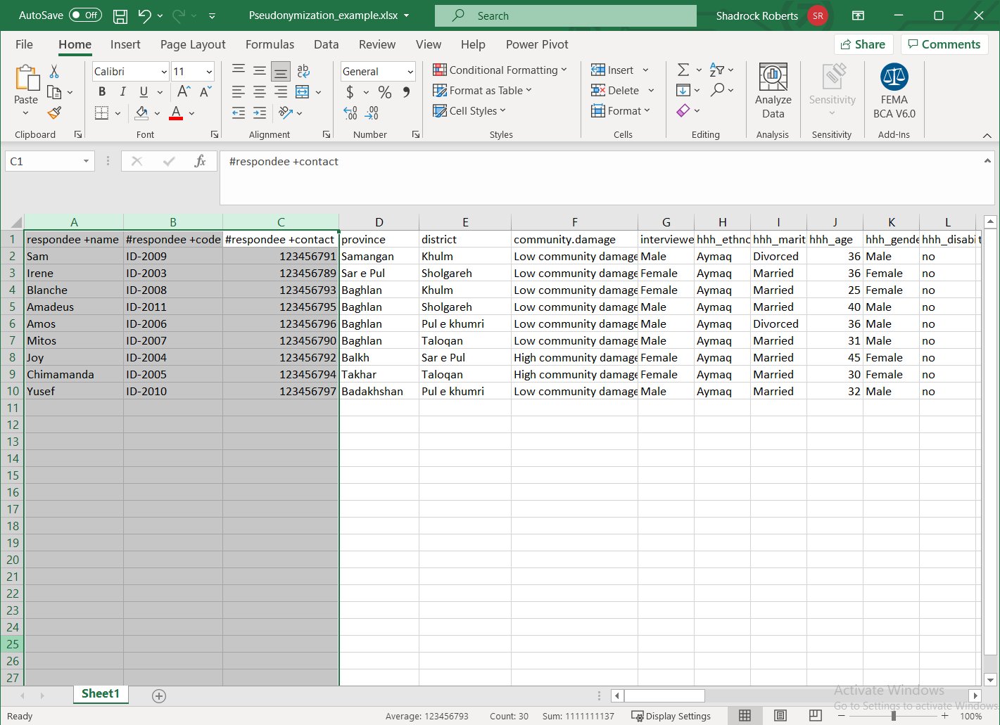
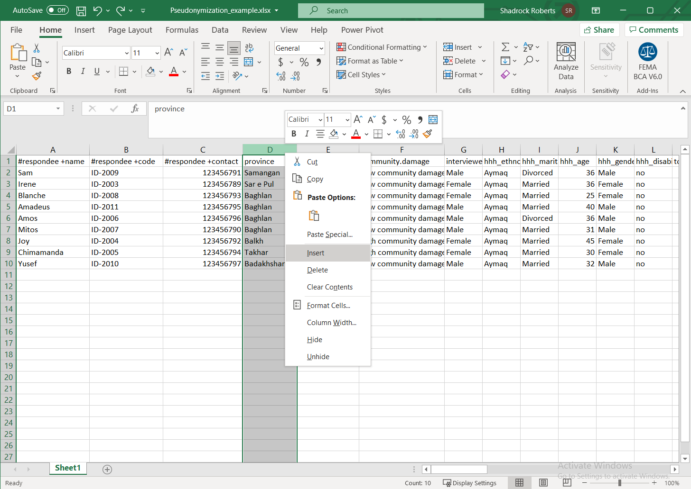
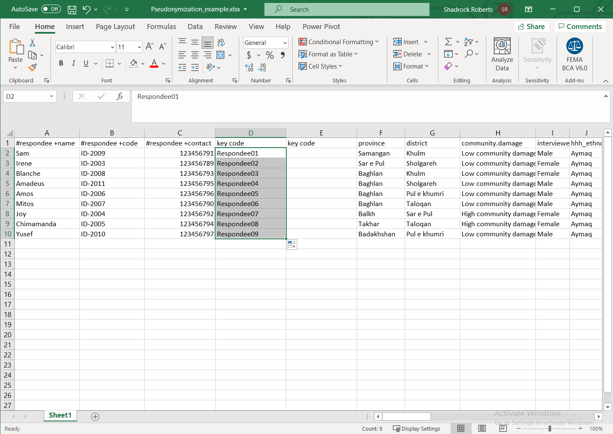
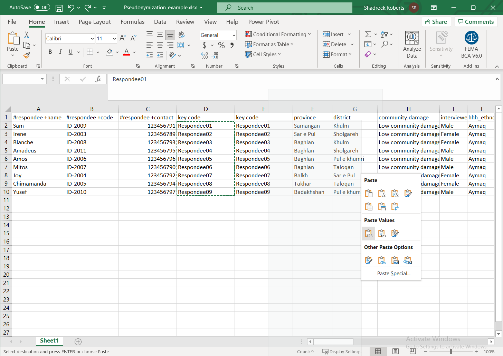
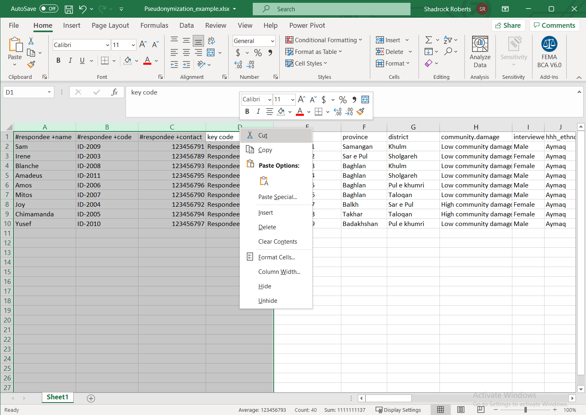
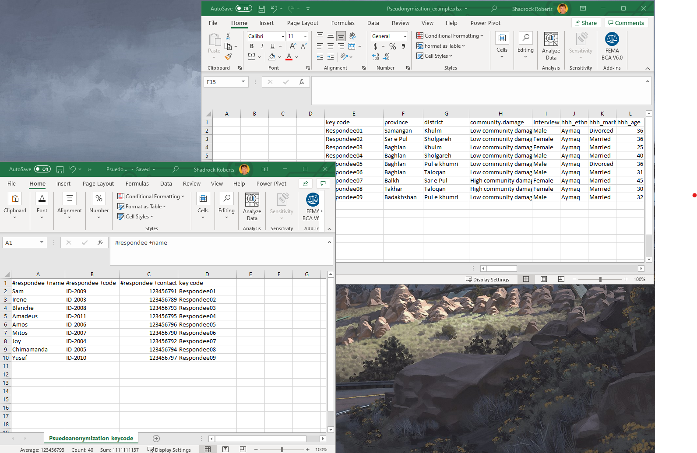

# استخدام الأسماء المستعارة
هذا مثال على إحدى طُرق إزالة تعريف البيانات في جدول بيانات. هناك مجموعة متنوعة من الوسائل الإجراء عملية إزالة التعريف، ويستخدم هذا المثال "الرمز الأساسي"لإزالة بيانات التعريف الشخصية الموجودة في المعرفات المباشرة والاحتفاظ بها في ملف منفصل. معلومات التعريف الشخصية (PII) هي المعلومات التي يمكن استخدامها لتحديد هوية الفرد. ومن الأمثلة الشائعة هي الاسم والعنوان ورقم الهاتف وتاريخ الميلاد ورقم الضمان الاجتماعي، أو رقم الهوية الوطنية.

 ويستخدم التمرين [مجموعة بيانات نموذجية موجودة في مجلد البيانات هنا](data/Pseudonymization_example.csv). عند قيامك بتسمية بيانات المثال باسماء مستعارة، يمكنك متابعة البرنامج التعليمي لمركز البيانات الإنسانية [لإجراء تقييم مخاطر الإفصاح](https://centre.humdata.org/learning-path/disclosure-risk-assessment-overview/).

 ## الخطوة 1 - تحديد معلومات التعريف الشخصية
 ابدأ بتحديد معلومات التعريف الشخصية في البيانات. وبطريقة مثالية، سيكون لديك بيانات وصفية - بيانات أو مستند تعرف بياناتك - لمساعدتك على فهم الحقول التي تحتوي على معلومات التعريف الشخصية. وفي نموذج البيانات ، هناك ثلاثة أعمدة تحتوي على معلومات تعريف الشخصية محتملة:
 - **#المُستجيب + االسم** يبدو أنه يحتوي على اسم.
 - **#المُستجيب + الرمز** من المحتمل أنه يحتوي على رقم تعريف من نوع ما.
 - **#المُستجيب + جِهة الاتصال** من المُحتمل ان يحتوي على رقم هاتف محمول.

يستخدم كل من هذه المعرفات المباشرة [لغة التبادل الإنساني لوضع علامات على البيانات](https://hxlstandard.org).

## الخطوة 2 - قُم بعمل أعمدة جديدة للرمز الأساسي
سنستخدم الرمز الأساسي - القيمة التي نحصُل عليها - لتقسيم معلومات التعريف الشخصية. نظرًا لأن المعرفات المباشرة مجمعة معًا ، فسننشئ عمودين جديدين بين الأعمدة C ،**#المُستجيب+ جهة الاتصال** والعمود D ، **المقاطعة**. نقوم بذلك في الإكسيل عن طريق تمييز عمود على يمين المكان الذي نريد إدراج أعمدة جديدة فيه، وننقر بزر الماوس الأيمن على العمود ونختار **إدراج**. كرر هذا الإجراء لعمل عمود آخر فارغ.

## الخطوة 3 - انشاء الرمز الأساسي
ابدأ بتسمية العمود الجديد. وسنستخد هُنا االسم "الرمز الأساسي" في كل منهما: كل عمود سيتحتوي على نفس القيم. وهذا هو الوقت الأنسب لتحديث أي بيانات وصفية حول مجموعة البيانات هذه لشرح ما يعنيه **الرمز الأساسي**. وبعدها، [سنستخدمخاصية التعبئة التلقائية في الإكسيل لإنشاء](https://support.microsoft.com/en-us/office/fill-data-automatically-in-worksheet-cells-74e31bdd-d993-45da-aa82-35a236c5b5db) رمز بسيط. أكتب **Respondee01** في أول خلية. ثُم حدد تلك الخلية، وانقر على علامة السحب في الزاوية اليمنى السفلية للخلية ، واسحبها لأسفل حتى نهاية مجموعة البيانات. سيؤدي هذا تلقائيًا إلى تعبئة الرقم النهائي لكل سجل بحيث يُصبح لكل مستجيب رمز جديد.

## الخطوة 4 - تكرار الرمز الأساسي، وإزالة المُعادلات
سنقوم الآن بنسخ الرمز الأساسي ولصقه في العمود المجاور. يمكنك القيام بذلك باستخدام أوامر لوحة المفاتيح الأساسية مثل **ctrl+c** أو حدد الخلايا التي تريد نسخها ، والنقر بزر الماوس الأيمن عليها، واختر **نسخ**. في العمود المجاور، حدد الخلايا التي تريد لصق الرمز الساسي الجديد فيها ، وانقر بزر الماوس الأيمن واختر **لصق**ً. لقد اخترت تحديداً لصق القيم فقط. وإذا استخدمت دالة لإنشاء رمز جديد، فسيكون من المهم الاحتفاظ بها القيم فقط الاستخدامها كرمز أساسي!

## الخطوة 5 - الفصل بين المعرفات المباشرة وغير المباشرة
حدد الأعمدة التي تحتوي على المعرفات المباشرة لمعلومات التعريف الشخصية وأحد أعمدة الرمز الرئيسي. في هذا المثال ، نُحدد الأعمدة من A إلى  D. انقر بزر الماوس الأيمن عليهم واختر **قص**.

وبعد ذلك ، افتح جدول بيانات جديد والصق فيه هذه القيم باستخدام اختصار لوحة المفاتيح **ctrl+v**، أو أي طريقة أخرى. احفظ جدول البيانات الجديد. لديك الآن جدولين للبيانات: يحتوي أحدهما على المعرفات غير المباشرة، بينما تحتوي الورقة الجديدة على المعرفات المباشرة ومعلومات التعريف الشخصية. تحتوي كلتا مجموعتي البيانات على رمز أساسي لكل سجل من سجلات البيانات بحيث يمكن إعادة تجميع جميع البيانات عند الضرورة.

## الخطوات التالية
يحتوي كلا الملفين على رمز أساسي يسمح بإعادة تجميعهما معًا. وتتمثل إحدى طرق القيام بذلك في الإكسيل، في استخدام دالة [VLOOKUP](https://support.microsoft.com/en-us/office/vlookup-function-0bbc8083-26fe-4963-8ab8-93a18ad188a1) لتعبئة الخلايا تلقائياً بناءً على قيمة الخلايا الأخرى. وفي هذه الحالة ، يمكنك تعبئة الخلايا الفارغة في الملف الأصلي بمعلومات التعريف الشخصية المفقودة بناءً على قيمة **رمز الأساسي**.

يجب تخزين الملف الجديد يحتوي على المعرفات المباشرة، والتي تحتوي على معلومات التعريف الشخصية ، في مكان آمن. من الطرق الممتازة للقيام بذلك هي تشفير الملف واستخدام التخزين السحابي لتحديد من يمكنه الوصول إلى الملف  **(راجع ارشادات أفضل ممارسات التشفير ومشاركة الملفات)**.

**تذكر: في حين أنه تم تحديد جدول البيانات الأصلي عن طريق إزالة المعرفات المباشرة التي تحتوي على معلومات التعريف الشخصية الواضحة ، فإن المعرفات غير المباشرة الأخرى يُمكن دمجها مع بيانات أخرى أو تحليلها بطريقة تسمح بتحديد هوية الفرد.** ولهذا السبب ، يجب تخزين كلا الملفين بشكل آمن. إذا كنت ترغب في مشاركة الملف الأصلي - ليس ملف معلومات التعريف الشخصية - فسيكون من الضروري إجراء تقييم مخاطر الإفصاح لضمان الحد الأدنى من مخاطر إعادة تعريف البيانات. مركز البيانات الإنسانية لديه [برنامج تعليمي عبر الإنترنت  إلجراء تقييم مخاطر الإفصاح](https://centre.humdata.org/learning-path/disclosure-risk-assessment-overview/) باستخدام [برنامج إحصائي مفتوح المصدر "ر"](https://www.r-project.org/). بالإضافة إلى ذلك، [تُتيح صفحة مُختبر مكافحة الفقر لإلغاء التعريف لنشر البيانات](https://www.povertyactionlab.org/resource/data-de-identification) مناقشة ممتازة لإلغاء تعريف البيانات، وتتضمن نموذج للتعليمات البرمجية لـبرنامج [ستاتا الإحصائي](https://www.stata.com/).
ومتاح داخلياً لموظفي ميرسي كور، [مسودة إرشادات](https://docs.google.com/document/d/1wFI5Ltvu9abtuRDVVZnbY2rdR61N3Eel4egZ02HuvU0/edit?usp=sharing) بها دوال إكسيل إضافية.

وأخيرًا ، تساعد كل هذه الخطوات معًا في التخفيف من مخاطر الكشف عن معلومات التعريف الشخصية ، لذلك يجب إدراجها في تقييم تأثير الخصوصية (PIA) **(راجع دليل تقييم تأثير الخصوصية)** حتى يفهم الآخرون كيفية حماية هذه البيانات.
