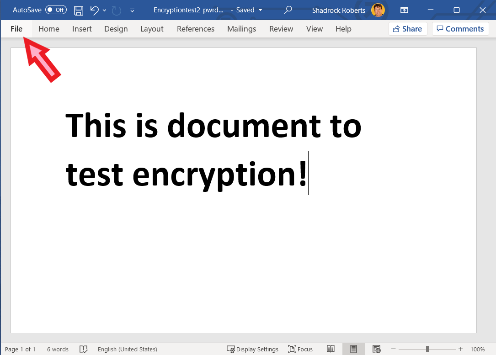
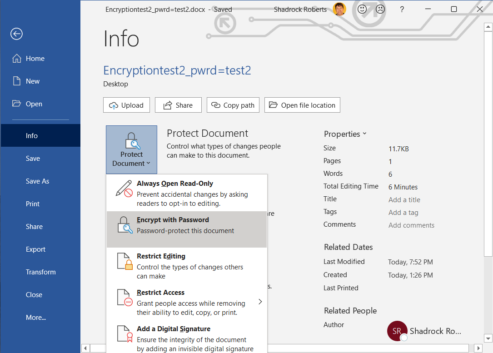
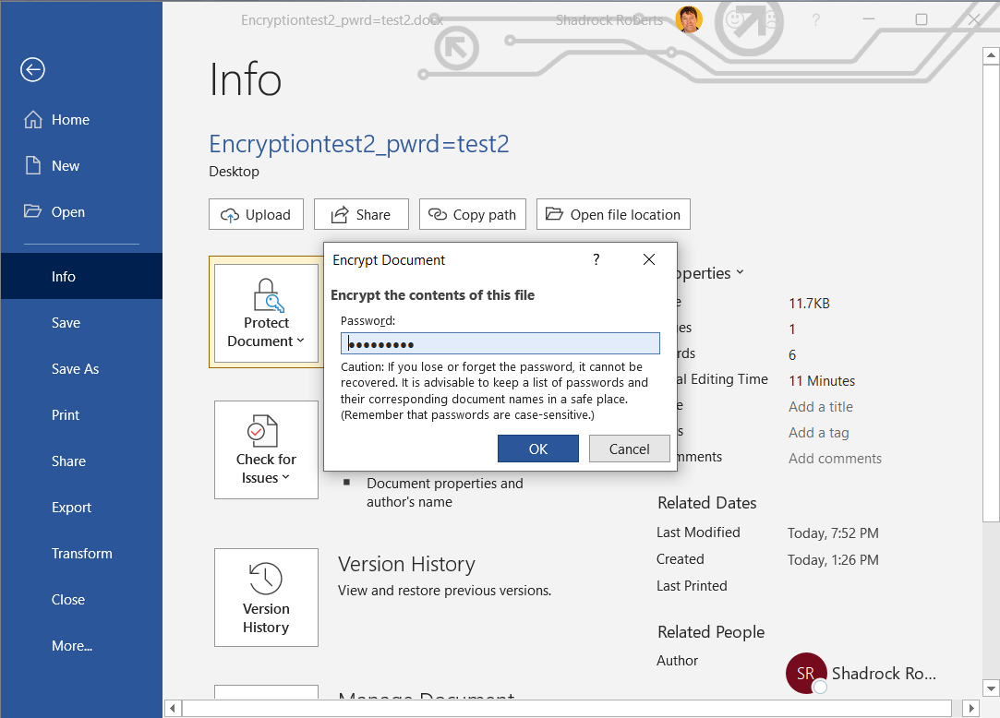
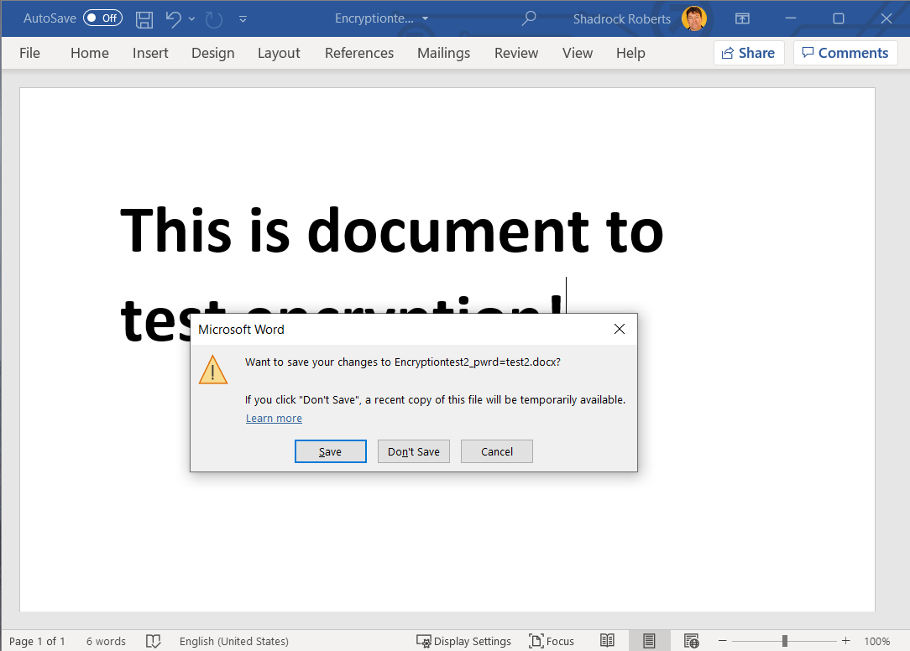

**تنسيقات أخرى**: راجع [مقاطع الفيديو المقترنة بهذا الدليل هنا](https://youtu.be/0o_jdQiTkvo). الوصول إلى الدليل [بصيغة PDF هنا.](https://dldocs.mercycorps.org/DPPEncryptionGuideAR.pdf)
## تشفير ملف
يتناول هذا القسم مثالاً أساسيًا تشفير ملف باستخدام خاصية مايكروسوفت المتوفرة على أجهزة حواسيب ميرسي كور. توجد مجموعة من العوامل التي يجب مراعاتها عند تشفير ملف ، ولكننا هنا نركز على استخدام كلمة مرور، وتشفير ملف واحد. انظر الروابط أدناه للتعرُّف على الموارد التي تتناول التشفير بشيء من التعمُق. من المفيد في هذا الدليل معرفة الاختلاف الدقيق بين "حماية كلمة المرور" و "التشفير".

تخيل الحماية بكلمة مرور وكأنها صندوق له قفل. عند حماية مُستندك "بكلمة مرور"، فكأنك تضع هذا المستند في صندوق إلكتروني وتغلقه بكلمة مرور: ومَن لديه كلمة مرور هو فقط الذي يمكنه فتح الصندوق. ولكن إن اخترت كلمة مرور ليست قوية جدًا ، أو إذا تشاركتها مع الشخص الخطأ ، فيمكن لأي شخص بسهولة الدخول إلى الصندوق ومشاهدة المُستند الخاص بك! وعلى خلاف ذلك ، يَستخدم التشفير خوارزميات معقدة لتشفير المعلومات ، الأمر الذي يتطلب وجود مفتاح لفك تشفير تلك المعلومات. تخيل هذا على أنه وضع مُستندك في خلال آلة لتمزيق الورق، وتلك الآلة تُحدد مفتاحًا خاصًا لإعادة تجميع المستند مرة أخرى.

وعند الجمع ما بين الحماية بكلمة المرور والتشفير ، فإنك تضاعف حمايتك بشكل فعال. فإذا نجح شخص ما في كسر كلمة مرور الصندوق الإلكتروني، فسيكون قادراً فقط على رؤية أجزاء الورق الممزقة ما لم يكُن لديه أيضا المفتاح المناسب. جميع حواسيب ميرسي كور المحمولة مشفرة باستخدام Microsoft BitLocker. هذا يمنع أقراص حواسيب ميرسي كور المحمول من الإزالة، أو والوصول إليها عبر حواسيب أخرى.

## الأهمية
يعد التشفير أمرًا بالغ الأهمية؛ لأنه يساعد على ضمان خصوصية المعلومات وأمانها. فبدون تشفير ، يمكن لأي شخص لديه حق الوصول إليها اعتراضها وقراءتها. عند التفكير فيما إذا كنت تريد تشفير البيانات أم لا ، سل نفسك ، "ما المخاطر التي يتعرض لها المشاركون في برنامج ميرسي كور ، وموظفيها، وشركائها في حالة فقدان هذه البيانات أو سرقتها؟" لذلك فإن تشفير أي شيء يحتوي على معلومات تعريف شخصية أو معلومات حساسة يُعد من القواعد الأساسية والمهمة.

## المبادئ
-  استخدم أنظمة Mercy Corps المعتمدة لنقل البيانات المشفرة وتخزينها (مثل Microsoft SharePoint أو Google Drive). وعندما تكون في شك، اطلب المشورة من فريق تكنولوجيا المعلومات المحلي.
-  قُم بتشفير البيانات الحساسة في جميع مراحل جمعها واستخدامها ونقلها وتخزينها.
- استخدم كلمات مرور قوية، ولا تعيد استخدام كلمات المرور. يتم تداول قوائم كلمات المرور عبر الإنترنت مما يُسهّل وصول شخص لديه إحدى كلمات المرور الخاصة بك إلى أكثر من حساب أو ملفات من ملفاتك الخاصة! قد ترغب في استخدام مدير لكلمات المرور، مثل Lastpass. ومع ذلك، قد يكون مديرو كلمات المرور عرضة للهجوم الإلكتروني من قبل التطبيقات المزيفة، لذلك من المهم أن يتم استخدام مديري كلمات المرور كجزء من نهج أوسع لتأمين البيانات.
- في بيئة الفريق، يكون التشفير فقط كقوة أضعف رابط. فإذا فشل شخص واحد في استخدام التشفير، فإن بيانات البرنامج الخاصة بك ستكون في خطر. فمن المهم للغاية توصيل هذه المعلومة إلى فريقك: التشفير ليس مجرد مسألة تقنية، ولكنه تغيير في السلوك أيضًا.
- افهم القوانين التي تحكم التشفير في بلدك. تضع القوانين المحلية في عدد من البلدان (مثل السودان واليمن وباكستان) قيودًا على برامج التشفير. في حالة الشك، اطلب المشورة من فريق تكنولوجيا المعلومات المحلي: بشكل عام سيعملون معك للتأكد من أن محرك الأقراص الثابت بحاسوبك مشفر بشكل مناسب باستخدام Intune.

## التعليمات
1. افتح ملف الوورد، أو الإكسيل، أو الباوربوينت الذي تريد تشفيره ومن القائمة اختر **ملف**.

2. انتقل إلى **معلومات > حماية المستند > تشفير بكلمة مرور.**

3. اكتب كلمة مرور، انقر فوق **موافق** ثم اكتبها مرة أخرى لتأكيدها.

4. احفظ الملف للتأكد من تفعيل كلمة المرور.

يمكنك الآن مشاركة الملف وكلمة المرور مع مَن يحتاجون إلى الوصول إليه. من أفضل الممارسات وضع الملف على خدمة سحابية معتمدة من ميرسي كور مثل G Suite أو SharePoint. وتذكر ارسال رابط الملف وكلمة المرور بشكل منفصل. على سبيل المثال، يمكنك مشاركة الملف باستخدام Google Drive **(راجع قسم مشاركة الملفات)** وعمل إشعار بأن الملف قد تمت مشاركته عبر جوجل، ثم مشاركة كلمة المرور عبر بريد إلكتروني مع زميل.

## مساعدة إضافية
- توفر مجموعة بدء المعلومات لشبكة عمل تعلم التحويل [النقدي الإلكتروني](https://www.calpnetwork.org/wp-content/uploads/2020/06/DataStarterKitforFieldStaffELAN.pdf) ورقة نصائح خاصة بالتشفير(أنظر صفحة النصائح 5).
- توفر مُنظمة Electronic Frontier [بيانات تفصيلية حول مختلف أشكال التشفير](https://ssd.eff.org/en/module/what-should-i-know-about-encryption).
- يتضمن [دليل Engine Room لاختصاصي التنمية الحديثة](https://the-engine-room.github.io/responsible-data-handbook/) قسمًا حول إدارة البيانات، كما يوفر أيضًا فكارًا إضافية عالية المستوى حول التشفير.
