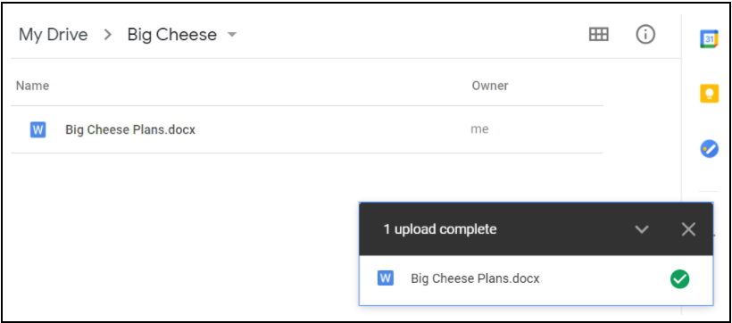
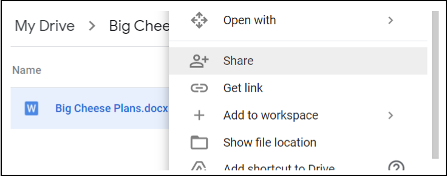
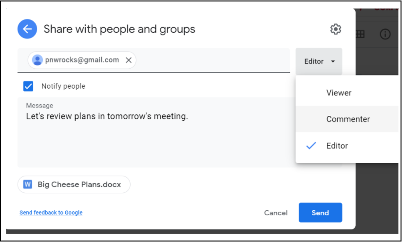
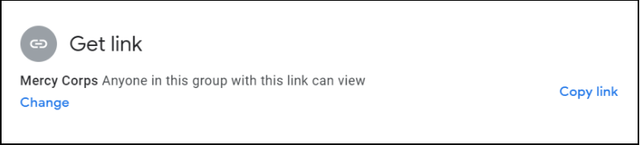
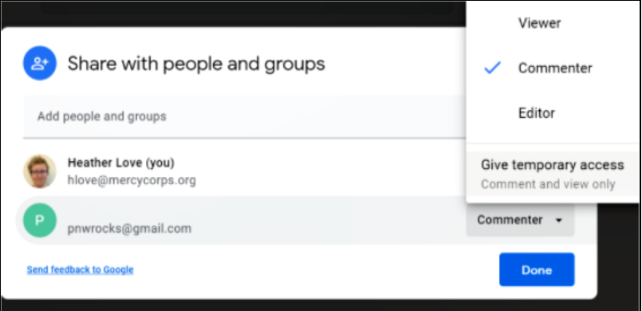
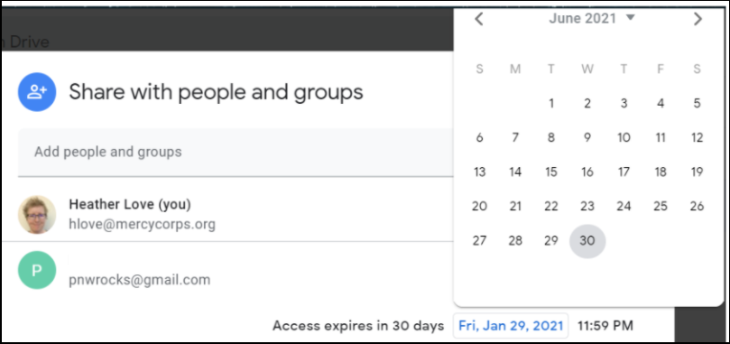
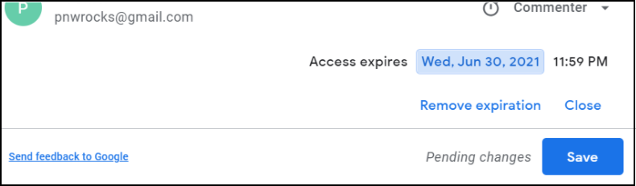
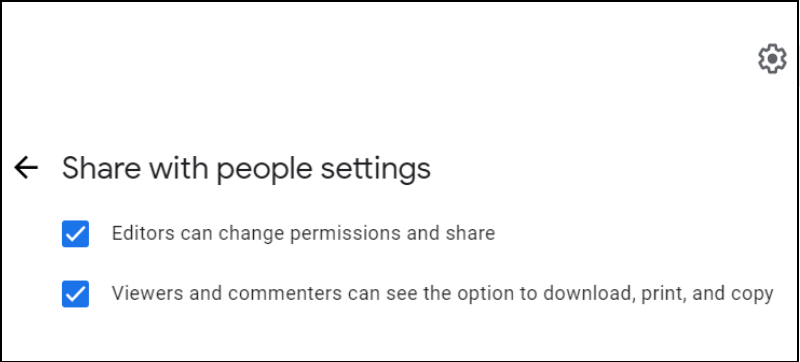

## مشاركة الملفات: GDrive
فيما يلي نموذج الاستخدام مشاركة ملف بأفضل الممارسات في Google Drive. تخيل أننا في العام 2020، وأن ميرسي كور تعمل مع مستشار(PNW Rocks) لإلنشاء مواد لمبادرة كبيرة جديدة في ميرسي كور، والتي تحمل الاسم الرمزي "Big Cheese" .ولن يُعلن عن مشروع "Big Cheese" حتى يوليو 2021، لذا من المهم تحديد مَن يمكنه الوصول إلى الملف. للبدء، نُريد التعاون بشأن الخطوات التالية للمشروع من خلال ملف يسمى "Big Cheese Plans."

## الخطوة 1 - رفع الملف
ارفع الملف إلى My Drive.

## الخطوة 2 - مُشاركة الملف
لمشاركة الملف، انقر بزر الماوس الأيمن فوق الملف ثم انقر فوق **مُشاركة.**

- امنح حق الوصول فقط لأولئك الذين يحتاجون إلى الملف. عند مشاركة ملف في My Drive، يكون الإعداد الافتراضي هو**مُقيَّد** (مُقيد للألشخاص أو المجموعات)، وهي أفضل ممارسة. تذكر، أنه يجب أن يكون هُناك دائماً قيود على الوصول إلى محتوى المعلومات السرية، أو الخاصة، أو معلومات التعريف الشخصية (PII).
- يجب استخدام خيار **أي مُستخدم لديه الرابط** فقط للملفات التي لا تحتوي على معلومات سرية وتكون مفتوحة للجمهور. أما استخدام **أي مُستخدم لديه الرابط** لملف يحتوي على بيانات سرية خاصة، أو شخصية، أو مالية ، فمن المُمكن مشاركته بسهولة، أو عن غير قصد وهذا يُعرَّض ميرسي كور لمخاطر قانونية فورية، ويُسهّل استخدام الجهات السيئة للمعلومات في أغراض إجرامية.  

## الخطوة 3 - تحديد مستوى الوصول
أدخل عنوان البريد الإلكتروني للشخص الذي تريد مشاركة الملف معه، ثم اختر مستوى الوصول. الوضع الافتراضي لوصول في جوجل هو **مُحرر**، وهو مُلائم فقط لأعضاء الفريق الذين يحتاجون إلى الوصول الكامل إلى المستند. أما عندما تقوم بإشراك ألأطراف الفاعلة للحصول على آرائهم، اختر **عارض أو مُعلّق**. أفضل الممارسات هي إخطار الشخص وإضافة رسالة توضح سبب مشاركة الملف. للإلشعار، اترك علامة **إشعار الأشخاص** كما هي. عندما تنتهي من التغييرات، انقر فوق **ارسال**.

خيار آخر هو إرسال بريد إلكتروني منفصل يحتوي على رابط للملف. للإلشعار بشكل منفصل عبر البريد الإلكتروني، أزل العلامة من مربع الاختيار **إشعار الأشخاص**. بعد النقر **تم**، انقر بزر الماوس الأيمن فوق الملف واختر **الحصول على الرابط**. في النافذة المنبثقة الجديدة، انقر فوق زر **نسخ الرابط**، ثم الصقه في بريدك الإلكتروني.

- لمعرفة المزيد حول مستويات الوصول، تفضَّل بزيارة [شارك وتعاون في My Drive](https://support.google.com/a/users/answer/9310248?hl=ar).
-  إذاقيدَّت ملف ، وقام شخص ما لديه حق الوصول بمشاركة الرابط مع شخص آخر، فلن يتمكن هذا الشخص تلقائيا من الوصول إلى هذا المحتوى في Google Drive. بل يرى صفحة ويب بها امكانية طلب حق الوصول. وسيرسل طلب حق الوصول إلى مالك الملف. ينبغي مراجعة طلبات الوصول، ولا ينبغي لمن يتلقون طلبات الوصول منح الإذن للطلبات أو أي منها، دون مراجعة الملاحظات والاعتبارات المذكورة أعلاه.

## الخطوة 4 - الوصول المؤقت
بمجرد منح الإذن، يمكن تخفيض الفترة الزمنية للمشاركة. ولتقييد الوصول انقر بزر الماوس الأيمن فوق الملف مرة أخرى، ثم انقر فوق **مُشاركة**. ابحث عن عنوان البريد الإلكتروني الذي شاركته للتو وانقر بزر الماوس الأيمن فوق مستوى الوصول. سترى خيارات جديدة تظهر؛ حدد **منح حق وصول مؤقت**.

سيظهر لك التقويم. انتقل إلى الشهر الذي تُريد أن تنتهي فيه صلاحية الوصول، وانقر فوق التاريخ المقابل.

سيختفي التقويم، ويتغير تاريخ العرض. وعندما ترى أن الوصول سوف تنتهي صلاحيته في التاريخ الصحيح، انقر **حفظ**.

## الخطوة 5 - خيارات إضافية

إذا كانت لديك مخاوف بشأن قيام الآخرين بإجراءات غير مناسبة مع المحتوى، توجد خيارات إضافية متاحة في شاشة الإعدادات. حيث يمكن الوصول إلى إعدادات الملف من خلال رمز الترس أعلى يمين نافذة المشاركة. انقر فوق الترس وستظهر لك خيارات المزيد من قيود المشاركة، أو تعطيل خيار التنزيل أو الطباعة أو النسخ. بالنسبة لأي خاصيَّة تريد تعطيلها، ما عليك سوى إزالة العلامة من مربع التحديد. وسيتم تحديث الملف، وحفظ الإعداد الجديد بسرعة.

- لمعرفة المزيد، تفضَّل بزيارة [خيارات تقييد المشاركة في Drive.](https://support.google.com/a/users/answer/9308868?hl=ar)

## اعتبارات إضافية
- لا تضع ملفات سرية داخل مجلدات يتم مشاركتها على نطاق واسع. تُمنح أذونات المجلدات المشتركة لكل ملف ومجلد فرعي، لذلك يمكن لأي شخص لديه إذن الوصول إلى المجلد الرئيسي الوصول إلى ملفك السري! ولتفادي ذلك، انقل ملفك السري إلى موقع جديد، خارج هيكل المجلد الأكبر الذي تمت مُشاركته.
- بمجرد مشاركة الملف، قد يتاح لك خيار **عمل نسخة** و / أو **نقل** الملف إلى موقع آخر. ال تنقل ملف مُطلقُا دون إذن من مالكه!  
-  إذا كنت بحاجة إلى رؤية الملف في ملفاتي أو في موقع ثانوي، فإن أفضل ممارسة هي استخدام خيار [أضف اختصارًا إلى Drive.](https://support.google.com/drive/answer/9700156?hl=ar&co=GENIE.Platform%3DDesktop)  
- إذا تم عمل نسخة من الملف، أو نُقل الملف، فاعلم أنه لن يكون له نفس الأذونات التي للملف الأصلي إلا إذا قمت بتعيين هذه الأذونات من جديد.

لا يغطي هذا الدليل مشاركة الملفات عبر محركات أقراص جوجل المشتركة، أو المنصات الخارجية لمشاركة الملفات. لمعرفة المزيد حول هذه، تفضل بزيارة [أفضل الممارسات لمشاركة الملفات عبر جوجل](https://support.google.com/a/users/answer/9310352?hl=ar) أو [إدارة صفحة مساحات الأقراص المشتركة.](https://support.google.com/a/topic/7337266?hl=ar&ref_topic=2490075) تتوفر كل صفحة من هذه الصفحات بعدة لغات: قم بالتمرير إلى أسفل الصفحة لتحديد لغتك.

أفضل طريقة للتحكم في الوصول إلى الملفات باستخدام Drive هي إنشاء مجموعة جوجل، وتعيين أذونات لأعضاء المجموعة. إن مجموعات جوجل ليست مخصصة فقط لإرسال رسائل البريد الإلكتروني، ولكنها أدوات قوية ومريحة لإدارة أذونات المجلدات والملفات. [اكتشف المزيد حول مجموعات جوجل.](https://support.google.com/groups/?hl=ar#topic=9216)

إذا كان مشروعك يتطلب استخدام تطبيقات خارج G Suite ، فشجع فريقك على التنزيل [جوجل Drive لسطح المكتب.](https://support.google.com/drive/answer/7329379?hl=ar) يتيح لك هذا البرنامج عرض أي مستندات في ملفاتي أو محركات الأقراص المشتركة كما لو كانت موجودة على الكمبيوتر المحمول، حتى في حالة عدم الاتصال بالإنترنت، ودون الحاجة إلى تنزيل العنصر أو تحويله إلى تنسيق جوجل.
