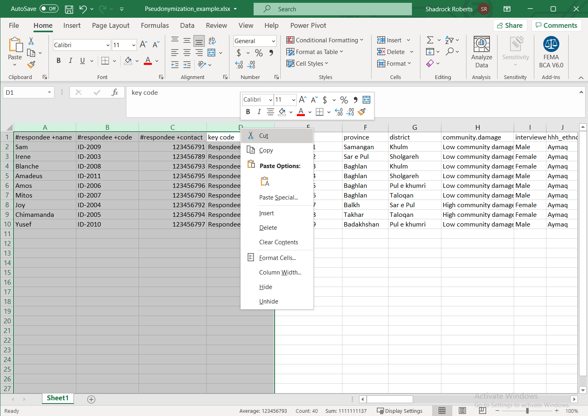

# Seudonimización
Este es un ejemplo de una forma de desidentificar datos en una hoja de cálculo. Hay una gran variedad de métodos de desidentificación y este ejemplo usa un «código clave» para eliminar la información de identificación personal que se encuentra en los identificadores directos y guardarla en un archivo separado. La información de identificación personal (PII) es información que se puede usar para identificar a un individuo. Los ejemplos más comunes son el nombre, dirección, número de teléfono, fecha de nacimiento y número de seguro social o de identificación nacional.

El ejercicio usa un [conjunto de datos de muestra que se encuentra en la carpeta de datos aquí](data/Pseudonymization_example.csv). Una vez que terminado la seudonimización de los datos de muestra, se puede continuar con el tutorial del Humanitarian Data Centre [para realizar una evaluación del riesgo de divulgación](https://centre.humdata.org/learning-path/disclosure-risk-assessment-overview/).

## Paso 1: identificar la PII
Comience por identificar la PII en los datos. Lo ideal es que disponga de metadatos (datos o un documento que defina sus datos) para ayudarle a comprender los campos que tienen PII. En los datos de la muestra, hay tres columnas que tienen posible PII::
- `#respondee +name` parece incluir un nombre.
- `#respondee +code` probablemente tiene un número de identificación de algún tipo.
- `#respondee +contact` posiblemente tiene un número de teléfono móvil.

Cada uno de estos identificadores directos usa el [Humanitarian Exchange Language para etiquetar los datos](https://hxlstandard.org).

## Paso 2: crear nuevas columnas para el código clave
Usaremos un código clave, un valor que generamos, para separar la PII. Como los identificadores directos están todos agrupados, crearemos dos nuevas columnas entre las columnas C, `#respondee +contact` y la columna D, `province`. En Excel, lo hacemos al resaltar una columna a la derecha de donde queremos insertar nuevas columnas, hacemos clic con el botón derecho en la columna y seleccionamos `Insert`. Vuelva a repetir este proceso para crear otra columna vacía.

## Paso 3: crear el código clave
Comience por nombrar sus nuevas columnas. Usaremos el «código clave» en cada una de ellas: cada columna contendrá los mismos valores. Este sería un buen momento para actualizar los metadatos de este conjunto de datos y explicar el significado del código clave. A continuación, usaremos la [función de Llenado Automático de Excel](https://support.microsoft.com/en-us/office/fill-data-automatically-in-worksheet-cells-74e31bdd-d993-45da-aa82-35a236c5b5db) para crear un código sencillo. Escriba `Respondee01` in the first cell. en la primera celda. A continuación, resalte esa celda, haga clic en el manejador de arrastre de la esquina inferior derecha de la celda y arrastre hasta el final del conjunto de datos. Esto llenará automáticamente el número final de cada registro para que cada respondedor tenga ahora un nuevo código.

## Paso 4: duplicar el código clave y eliminar las fórmulas
Ahora copiaremos el código clave y lo pegaremos en la columna adyacente. Puede hacerlo con comandos básicos del teclado como `ctrl + c` o al resaltar las celdas que desea copiar, al hacer clic con el botón derecho del mouse y seleccionar `Copy`. En la columna adyacente, resalte las celdas en las que desea pegar el nuevo código clave, haga clic con el botón derecho y elija `Paste`. Opté por pegar específicamente solo los valores. Si ha usado una fórmula para crear un nuevo código, ¡será importante conservar solo los valores para usarlos como código clave!

## Step 5 - Separate Direct and Indirect Identifiers
Resalte las columnas que tienen los identificadores directos con PII junto con una de las columnas de códigos clave. En este ejemplo, resaltamos las columnas A-D. Haga clic con el botón derecho sobre ellas y seleccione `Cut`.

A continuación, abra una nueva hoja de cálculo y pegue estos valores con el atajo de teclado `ctrl + v`, u otro método. Guarde la nueva hoja de cálculo. Ahora tiene dos hojas de cálculo: una tiene los identificadores indirectos mientras que la nueva tiene los identificadores directos con PII. Ambos conjuntos de datos tienen un código clave para cada registro de los datos, de modo que todos los datos se puedan recombinar cuando sea necesario.

## Próximos pasos
Ambos archivos tienen un código clave que permitirá volver a unirlos. Una forma de hacer esto en Excel, es usar la [función `VLOOKUP`](https://support.microsoft.com/en-us/office/vlookup-function-0bbc8083-26fe-4963-8ab8-93a18ad188a1) para llenar automáticamente las celdas según el valor de otras celdas. En este caso, podría llenar las celdas vacías del archivo original con la PII que falta, según el valor del código clave.

Dado que el nuevo archivo tiene los identificadores directos que tienen PII, se debe almacenar de forma segura. Una forma excelente de hacerlo es cifrar el archivo y usar el almacenamiento en la nube para limitar el acceso al archivo (consulte las guías de _Mejores prácticas para el uso compartido de archivos_ y _Cifrado de un archivo_).

**Recuerde: aunque se ha desidentificado la hoja de cálculo original al eliminar los identificadores directos que tienen PII evidentes, los demás identificadores indirectos tienen el potencial de combinarse con otros datos o analizarse de forma que permitan identificar a una persona.** Por esta razón, ambos archivos se deben seguir almacenando de forma segura. Si se desea compartir el archivo original, no-PII, de forma más amplia, sería fundamental realizar una evaluación del riesgo de divulgación para garantizar que el riesgo de que los datos puedan ser reidentificados sea mínimo. El Humanitarian Data Centre tiene un [tutorial en línea para realizar una evaluación del riesgo de divulgación](https://centre.humdata.org/learning-path/disclosure-risk-assessment-overview/) con el [software estadístico de código abierto «R»](https://www.r-project.org/). Además, la página web de [Poverty Action Lab's *De-identification for data publication*](https://www.povertyactionlab.org/resource/data-de-identification) ofrece un excelente debate sobre la desidentificación de datos e incluye un código de muestra para el [software estadístico Stata](https://www.stata.com/). Para el personal de Mercy Corps, el [borrador de la guía de T4D](https://docs.google.com/document/d/1wFI5Ltvu9abtuRDVVZnbY2rdR61N3Eel4egZ02HuvU0/edit?usp=sharing) está disponible internamente y proporciona fórmulas adicionales en Excel.  

Por último, todos estos pasos juntos ayudan a mitigar el riesgo o la exposición de la PII, por lo que deben estar en la PIA (consulte la guía de _Evaluación de impacto en la privacidad_) para que otros entiendan cómo se protegen estos datos.
