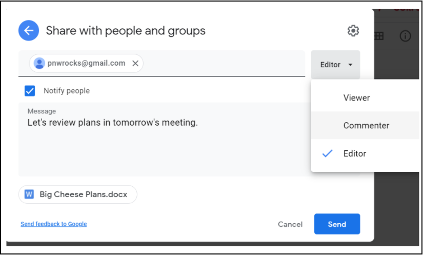

# Uso compartido de archivos: GDrive
A continuación, se presenta un ejemplo del uso compartido de un archivo con las mejores prácticas en Google Drive. Imagine que es el año 2020 y que Mercy Corps está trabajando con un consultor (PNW Rocks), para crear materiales para una iniciativa nueva e importante de Mercy Corps, cuyo nombre en clave es Big Cheese. El proyecto Big Cheese no se anunciará públicamente hasta julio de 2021, por lo que es importante limitar el acceso al archivo. Para empezar, convendría que se colabore en los próximos pasos del proyecto con un archivo llamado «Big Cheese Plans».

## Paso 1: cargar
Suba el archivo a My Drive.

## Paso 2: compartir
Para compartir el archivo, haga clic con el botón derecho del mouse en el archivo y luego en `Compartir`.

  - Solo otorgue el acceso a aquellos que necesitan el archivo. Cuando comparte un archivo en My Drive, la configuración por defecto es `Restringido` (a personas o grupos), que es la mejor práctica. ¡Recuerde que el contenido confidencial, privado o de información de identificación personal (PII) debe tener siempre acceso restringido!
  - La opción `Cualquiera con el enlace` solo se debe usar para archivos que no contengan información confidencial y estén abiertos al público. Si se usa la opción `Cualquiera con el enlace` en un archivo con datos confidenciales privados, personales o financieros, se podría compartir fácil y accidentalmente y poner a Mercy Corps en riesgo legal inmediato y facilitar a los malos actores el uso de la información con fines delictivos.

## Paso 3: seleccionar el nivel de acceso
Ingrese la dirección de correo electrónico de la persona con la que desea compartir, y luego elija el nivel de acceso. Google establece por defecto el acceso de `Editor`, que solo es apropiado para los miembros del equipo que necesitan acceso completo al documento. Si desea solicitar la opinión de los interesados, elija `Espectador` o `Comentarista`. La mejor práctica es notificar a la persona, y agregar un mensaje, explicando el motivo por el que compartió el archivo. Para notificar, deje marcada la casilla `Notificar a las personas`. Cuando haya terminado con los cambios, haga clic en `Enviar`.

Otra opción es enviar un correo electrónico separado con un enlace al archivo. Para notificar por separado por correo electrónico, desmarque la casilla `Notificar a las personas`. Después de hacer clic en `Listo`, haga clic con el botón derecho del mouse en el archivo y elija `Obtener enlace`. En la nueva ventana emergente, haga clic en el botón `Copiar enlace` y péguelo en su correo electrónico.

- Para obtener más información sobre los niveles de acceso, visite [Compartir y colaborar en Mi unidad](https://support.google.com/a/users/answer/9310248?hl=es).
- Si restringe un archivo y alguien con acceso comparte el enlace a otra persona, no tendrá acceso automáticamente a ese contenido en Google Drive. En su lugar, verán una página web que le permitirá solicitar el acceso. La solicitud de acceso se dirigirá al propietario del archivo. Debe revisar las solicitudes de acceso, y los que reciben las solicitudes de acceso no deben simplemente otorgar permiso a todas y cada una de las solicitudes, sin revisar las notas y consideraciones anteriores.

## Paso 4: acceso temporal
Una vez que se otorgó el permiso, se puede acortar el periodo de uso compartido. Para limitar el acceso, vuelva a hacer clic con el botón derecho del mouse en el archivo y haga clic en `Compartir`. Busque la dirección de correo electrónico que acaba de compartir y haga clic con el botón derecho en el nivel de acceso. Verá que aparecen nuevas opciones; seleccione `Dar acceso temporal`.

Aparecerá un calendario. Navegue hasta el mes en el que debe vencer el acceso y haga clic en la fecha correspondiente.

Desaparecerá el calendario y cambiará la fecha de la pantalla. Una vez que puede ver que el acceso vencerá en la fecha correcta. Haga clic en `Guardar`.

## Paso 5: opciones adicionales
Si le preocupa que otras personas realicen acciones inapropiadas con el contenido, hay opciones adicionales disponibles en la pantalla de configuración. Se puede acceder a la configuración de los archivos desde el icono del engranaje en la parte superior derecha de la ventana de uso compartido. Haga clic en el engranaje y verá las opciones para restringir el uso compartido o desactivar la opción de descargar, imprimir o copiar. Para cualquier función que desee desactivar, simplemente desmarque la casilla. El archivo se actualizará rápidamente, guardando la nueva configuración

- Para saber más, visite [Restringir las opciones de uso compartido de Drive](https://support.google.com/a/users/answer/9308868?hl=es).

### Consideraciones adicionales
  - No coloque archivos confidenciales dentro de carpetas que sean ampliamente compartidas. Los permisos de las carpetas compartidas se extienden a cada archivo y subcarpeta, por lo que cualquier persona con permiso para la carpeta principal podrá acceder a su archivo confiden-cial. En su lugar, mueva su archivo confidencial a una nueva ubicación, fuera de la estructura de carpetas compartidas más grande.
  - Una vez que se haya compartido un archivo, puede tener la opción `Hacer una copia` o `Mover` el archivo a otra ubicación. ¡Nunca mueva un archivo sin el permiso del propietario!
  - Si necesita ver el archivo en My Drive o en una ubicación secundaria, la mejor práctica es usar la opción [Buscar archivos y carpetas con los accesos directos de Google Drive](https://support.google.com/drive/answer/9700156?hl=es&co=GENIE.Platform%3DDesktop).
  - Si se hace una copia del archivo, o se mueve el archivo, tenga en cuenta que no tendrá los mismos permisos que el archivo original a menos que establezca explícitamente esos permisos.

Esta guía no cubre el uso compartido de archivos en las unidades compartidas de Google, ni las plataformas externas para el uso compartido de archivos. Para obtener más información al respecto, visite la página de Google sobre las [Prácticas recomendadas sobre unidades compartidas](https://support.google.com/a/users/answer/9310352?hl=es) o [sobre la gestión de las unidades compartidas](https://support.google.com/a/topic/7337266?hl=es&ref_topic=2490075). Cada una de estas páginas está disponible en varios idiomas: desplácese hasta el final de la página para seleccionar su idioma.

La mejor manera de controlar el acceso a los archivos con Drive es crear un grupo de Google y asignar permisos a los miembros del grupo. Los grupos de Google no solo sirven para enviar correos electrónicos; los grupos son herramientas potentes y cómodas para gestionar los permisos de carpetas y archivos. [Más información sobre Grupos de Google.](https://support.google.com/groups/?hl=es#topic=9216).

Si su proyecto requiere el uso de aplicaciones fuera de G Suite, anime a su equipo a descargar [Google Drive para ordenadores](https://support.google.com/drive/answer/7329379?hl=es). Este programa le permite ver cualquier documento de My Drive o de las unidades compartidas como si estuvieran en su computadora, incluso sin conexión, y sin tener que descargar el elemento o convertirlo a un formato de Google..
