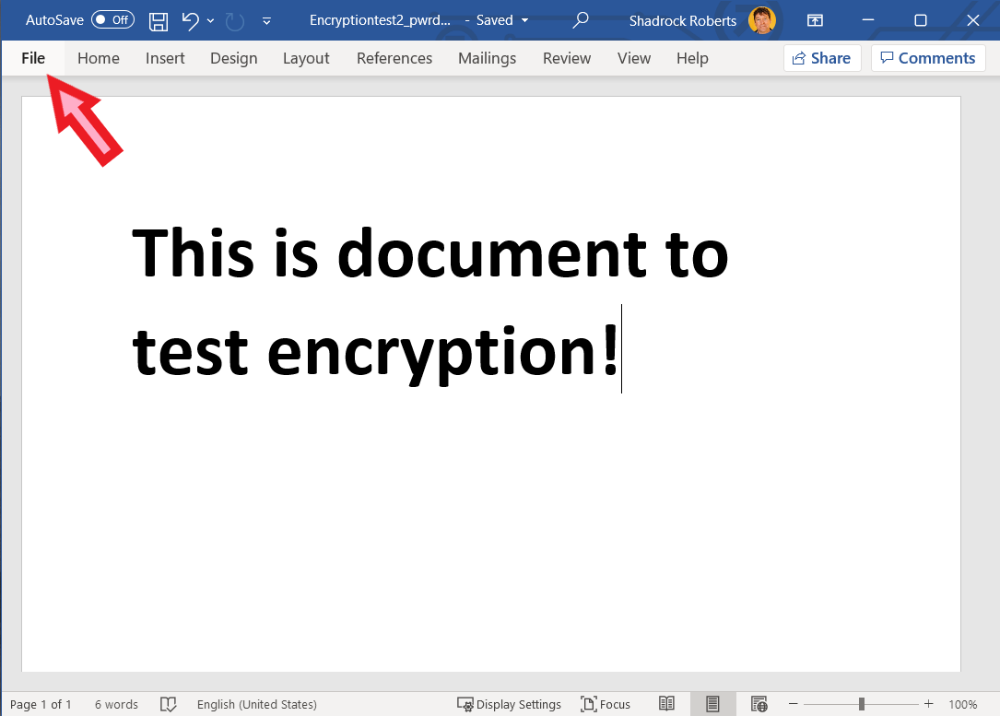
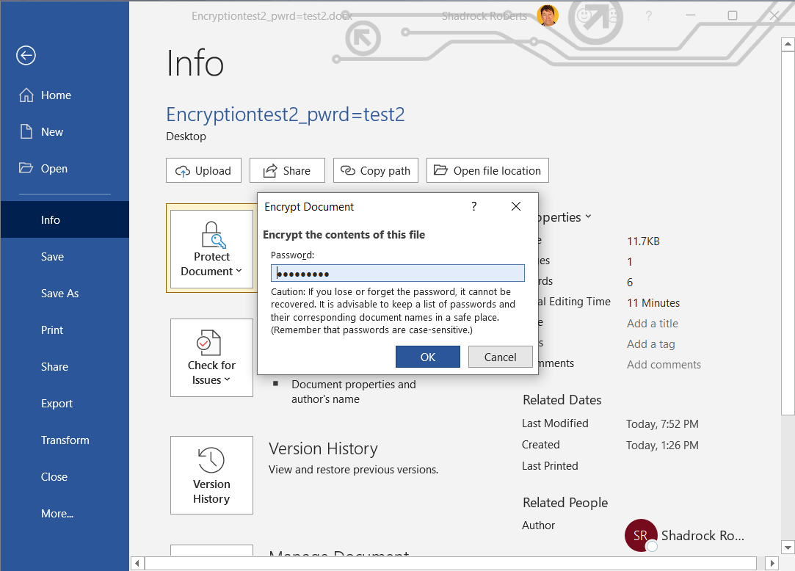

# Cryptage d'un fichier
Ce guide aborde un exemple de base de cryptage d'un fichier à l'aide d'une fonction Microsoft disponible sur les ordinateurs de Mercy Corps. Il existe une série de facteurs à prendre en compte lors du cryptage d'un fichier, mais nous nous concentrons ici sur l'utilisation d'un mot de passe et le cryptage d'un seul fichier. Voir les liens ci-dessous pour des ressources qui explorent le cryptage de manière plus approfondie. Pour ce guide, il est toutefois utile de comprendre la différence subtile entre « protection par mot de passe » et « cryptage ».

Considérez la protection par mot de passe comme une boîte munie d'un verrou. Lorsque vous « protégez » votre document par un mot de passe, vous le placez dans une boîte électronique que vous verrouillez à l'aide d'un mot de passe : seules les personnes disposant du mot de passe peuvent ouvrir la boîte. Cependant, si le mot de passe que vous choisissez n'est pas très fort, ou s'il est partagé avec la mauvaise personne, quelqu'un peut facilement entrer dans la boîte et voir votre document ! En revanche, le cryptage utilise des algorithmes complexes pour coder des informations, ce qui nécessite de disposer d'une clé pour décrypter ces informations. Imaginez que vous prenez votre document et le passez dans un destructeur de papier qui attribue une clé spéciale pour reconstituer le document.
Lorsque vous combinez protection par mot de passe et cryptage, vous doublez effectivement votre protection. Si quelqu'un réussit à forcer le mot de passe du boîtier électronique, il ne pourra voir que les morceaux de papier déchiqueté sans avoir également la clé appropriée. Tous les ordinateurs portables de Mercy Corps sont cryptés à l'aide de Microsoft BitLocker. Cela permet d'éviter que le disque dur d'un ordinateur portable Mercy Corps soit retiré et accessible sur un autre ordinateur.

## Importance
Le cryptage est essentiel car il permet de garantir la confidentialité et la sécurité des informations. Sans cryptage, les données peuvent être interceptées et lues par toute personne qui y a accès. Lorsque vous envisagez de crypter ou non des données, posez-vous la question suivante : « Quel est le risque pour les participants aux programmes de Mercy Corps, son personnel et ses partenaires si ces données étaient perdues ou volées ? » Une bonne règle de base est de chiffrer tout ce qui contient des informations personnelles identifiables ou sensibles.

## Principes
- Utilisez les systèmes approuvés de Mercy Corps pour le transfert et le stockage de données cryptées (par exemple, Microsoft SharePoint ou Google Drive). En cas de doute, demandez conseil à votre équipe informatique locale.
- Cryptez les données sensibles à tous les stades de leur collecte, utilisation, transmission et stockage.
- Utilisez des mots de passe forts et ne réutilisez pas les mots de passe. Les listes de mots de passe circulent en ligne et permettent à une personne possédant l'un de vos mots de passe d'accéder plus facilement à plusieurs de vos comptes ou fichiers ! Vous pouvez utiliser un gestionnaire de mots de passe, tel que [Lastpass](https://www.lastpass.com/). Cependant, les gestionnaires de mots de passe peuvent être vulnérables aux cyberattaques par de fausses applications. Il est donc essentiel que les gestionnaires de mots de passe soient utilisés dans le cadre d'une approche plus large de la sécurisation des données.
- Dans un environnement d'équipe, le cryptage est aussi bon que le maillon le plus faible. Si une seule personne n'utilise pas le cryptage, les données de votre programme sont en danger. Il est extrêmement important de communiquer ce point à votre équipe : le cryptage n'est pas seulement une question de technologie, mais aussi de changement de comportement.
- Comprenez les lois qui régissent le cryptage dans votre pays. Les lois locales d'un certain nombre de pays (comme le Soudan, le Yémen et le Pakistan) imposent des limites aux logiciels de cryptage. En cas de doute, demandez conseil à votre équipe informatique locale : en général, elle travaillera avec vous pour s'assurer que le disque dur de vos ordinateurs soit correctement crypté à l'aide d'Intune.

## Instructions

1. Ouvrez le fichier Word, Excel ou PowerPoint que vous souhaitez crypter et sélectionnez le menu `Fichier`.

2. Naviguez jusqu'à `Info` > `Protéger le document` > `Crypter avec un mot de passe`.

3. Tapez un mot de passe, cliquez sur `OK` puis tapez-le à nouveau pour le confirmer.

4. Ouvrez le fichier pour vous assurer que le mot de passe prenne effet.

Vous pouvez maintenant partager le fichier et le mot de passe avec les personnes qui ont besoin d'y accéder. La meilleure pratique consiste à placer le fichier sur un service en nuage approuvé par Mercy Corps, tel que G Suite ou SharePoint. N'oubliez pas d'envoyer le lien du fichier et celui du mot de passe séparément. Par exemple, vous pouvez partager le fichier à l'aide de Google Drive (voir le guide *Meilleures pratiques en matière de partage de fichiers*) et générer un avis indiquant que le fichier a été partagé via Google, puis communiquer le mot de passe par courrier électronique à un collègue

## Assistance supplémentaire
- Le [Data Starter Kit](https://www.calpnetwork.org/wp-content/uploads/2020/06/DataStarterKitforFieldStaffELAN.pdf) du Electronic Cash Transfer Learning Action Network fournit une fiche de conseils pour le cryptage (voir fiche de conseils n° 5).
- L'Electronic Frontier Foundation [fournit un aperçu plus détaillé des différentes formes de cryptage](https://ssd.eff.org/en/module/what-should-i-know-about-encryption).
- Le [*manuel du spécialiste en développement moderne*](https://the-engine-room.github.io/responsible-data-handbook/) de l'Engine Room comprend une section sur la gestion des données qui fournit des réflexions supplémentaires de haut niveau sur le cryptage.
