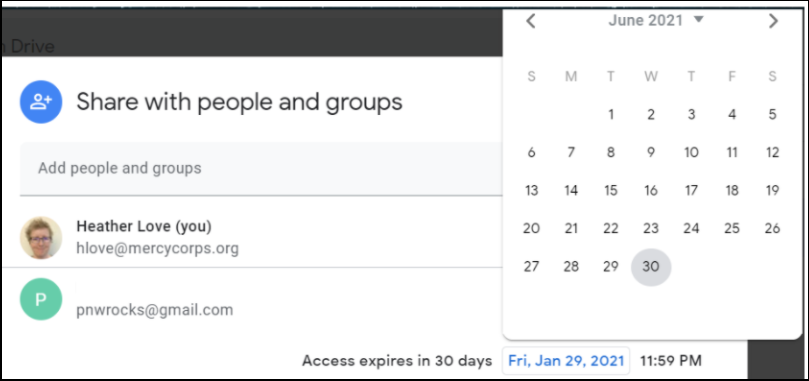
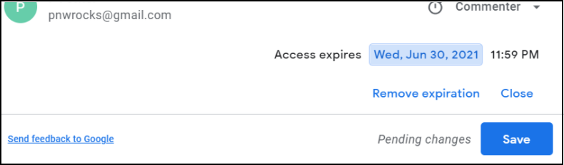

# Partage de fichiers : GDrive
Voici un exemple de cas d'utilisation pour le partage d'un fichier en utilisant les meilleures pratiques de Google Drive. Imaginez que nous sommes en 2020 et que Mercy Corps travaille avec un consultant (PNW Rocks), afin de créer du matériel pour une nouvelle initiative majeure de Mercy Corps, dont le nom de code est Big Cheese. Le projet Big Cheese ne sera pas annoncé publiquement avant juillet 2021, il est donc important de limiter les personnes ayant accès au dossier. Pour commencer, nous voulons collaborer sur les prochaines étapes du projet dans un fichier appelé « Big Cheese Plans ».

## Étape 1 - Téléverser
Téléverser le fichier sur My Drive.

## Étape 2 - Partager
Pour partager le fichier, cliquez avec le bouton droit de la souris sur le fichier, puis cliquez sur `Partager`.

  - Ne donnez l'accès qu'à ceux qui ont besoin du fichier. Lorsque vous partagez un fichier dans Mon lecteur, le paramètre par défaut est `Restreint` (aux personnes ou aux groupes), ce qui est la meilleure pratique. Les contenus confidentiels, privés ou contenant des informations person-nelles identifiables (PII) devraient *toujours* avoir un accès restreint.
  - L'option `Toute personne ayant le lien` ne doit être utilisée que pour les fichiers qui ne contiennent aucune information confidentielle et qui sont ouverts au public. Si le paramètre `Toute personne ayant le lien` est utilisé sur un fichier contenant des données confidentielles privées, personnelles ou financières, il pourrait facilement et accidentellement être partagé et faire courir un risque juridique immédiat à Mercy Corps et faciliter l'utilisation des informations à des fins criminelles par de mauvais acteurs.

## Étape 3 - Sélectionner le niveau d'accès
Saisissez l'adresse électronique de la personne avec laquelle vous souhaitez partager, puis choisissez le niveau d'accès. Par défaut, Google propose un accès `Éditeur` , qui ne convient qu'aux membres de l'équipe qui ont besoin d'un accès complet au document. Lorsque vous sollicitez le retour d'information des parties prenantes, choisissez `Visionneur` ou `Commentateur`. La meilleure pratique consiste à informer la personne concernée et à ajouter un message expliquant pourquoi vous avez partagé le fichier. Pour notifier, laissez la case `Notifier les personnes` cochée. Lorsque vous avez terminé les modifications, cliquez sur `Envoyer`.

Une autre option consiste à envoyer un courriel distinct contenant un lien vers le fichier. Pour notifier séparément par e-mail, décochez la case `Notifier les personnes`. Après avoir cliqué sur `Terminé`,  faites un clic droit sur le fichier et choisissez `Obtenir le lien`. Dans la nouvelle fenêtre contextuelle, cliquez sur le bouton `Copier le lien`, puis collez-le dans votre courriel.

- Pour en savoir plus sur les niveaux d'accès, visitez [Partager et collaborer dans My Drive](https://support.google.com/a/users/answer/9310248?hl=fr).
- Si vous limitez un fichier et qu'une personne ayant un accès partage le lien avec une autre personne, cette dernière n'aura pas automatique-ment accès à ce contenu dans Google Drive. Au lieu de cela, ils verront une page web avec la possibilité de demander un accès. La demande d'accès sera adressée au propriétaire du dossier. Les demandes d'accès doivent être examinées, et les personnes, qui reçoivent les de-mandes d'accès, ne doivent pas simplement accorder l'autorisation à toutes les demandes, sans examiner les notes et considérations ci-dessus.

## Étape 4 - Accès temporaire
Une fois l'autorisation accordée, la période de partage peut être raccourcie. Pour limiter l'accès, cliquez à nouveau sur le fichier avec le bouton droit de la souris, puis cliquez sur `Partager`. Trouvez l'adresse électronique que vous venez de partager et faites un clic droit sur le niveau d'accès. Vous verrez apparaître de nouvelles options ; sélectionnez `Donner un accès temporaire`.

Un calendrier s'affiche. Naviguez jusqu'au mois où l'accès doit expirer, et cliquez sur la date correspondante.

Le calendrier disparaît et la date affichée change. Une fois que vous pouvez voir que l'accès expirera à la bonne date. Cliquez sur `Enregistrer`

## Étape 5 - Options supplémentaires
Si vous craignez que d'autres personnes ne prennent des mesures inappropriées avec le contenu, des options supplémentaires sont disponibles dans l'écran des paramètres. Les paramètres des fichiers sont accessibles à partir de l'icône d'engrenage en haut à droite de la fenêtre de partage. Cliquez sur l'engrenage et vous verrez des options permettant de restreindre le partage ultérieur, ou de désactiver l'option de téléchargement, d'impression ou de copie. Pour toute fonction que vous souhaitez désactiver, il suffit de décocher la case. Le fichier sera rapidement mis à jour, enregistrant le nouveau paramètre.

- Pour en savoir plus, visitez [Restreindre les options de partage des fichiers Drive sensibles](https://support.google.com/a/users/answer/9308868?hl=fr).

### Considérations supplémentaires
  - Ne placez pas de fichiers confidentiels dans des dossiers qui sont largement partagés. Les autorisations des dossiers partagés se répercutent sur chaque fichier et sous-dossier, de sorte que votre fichier confidentiel peut être consulté par toute personne disposant d'une autorisation pour le dossier parent ! Déplacez plutôt votre fichier confidentiel vers un nouvel emplacement, en dehors de la structure du dossier partagé.
  - Une fois qu'un fichier a été partagé, vous pouvez avoir la possibilité d'en `faire une copie` et/ou de le `déplacer` vers un autre emplacement. Ne déplacez jamais de fichiers sans l'autorisation du propriétaire !
  - Si vous avez besoin de voir le fichier dans votre My Drive ou dans un emplacement secondaire, la meilleure pratique est d'utiliser l’option [Créer un raccourci à Drive](https://support.google.com/drive/answer/9700156?hl=fr&co=GENIE.Platform%3DDesktop).
  - Si une copie de fichier est effectuée, ou si le fichier est déplacé, sachez qu'il ne disposera pas des mêmes autorisations que le fichier d'origine, à moins que vous ne définissiez explicitement ces autorisations.

Ce guide ne couvre pas le partage de fichiers dans les lecteurs partagés de Google, ni les plateformes externes de partage de fichiers. Pour en savoir plus sur celles-ci, visitez les pages [Bonnes pratiques concernant les Drive partagés](https://support.google.com/a/users/answer/9310352?hl=fr) ou [Gérer les Drive partagés](https://support.google.com/a/topic/7337266?hl=fr&ref_topic=2490075). Chacune de ces pages est disponible en plusieurs langues : faites défiler la page jusqu'en bas pour sélectionner votre langue.

La meilleure façon de contrôler l'accès aux fichiers à l'aide de Drive est de créer un groupe Google et d'attribuer des autorisations aux membres du groupe. Les groupes Google ne servent pas uniquement à envoyer des courriels ; les groupes sont des outils puissants et pratiques pour gérer les autorisations de dossiers et de fichiers. [En savoir plus sur les groupes Google](https://support.google.com/groups/?hl=fr#topic=9216).

Si votre projet nécessite l'utilisation d'applications en dehors de G Suite, encouragez votre équipe à télécharger [Google Drive for desktop](https://support.google.com/drive/answer/7329379?hl=fr). Ce programme vous permet de visualiser tous les documents de My Drive ou des lecteurs partagés comme s'ils étaient sur votre ordinateur portable, même hors ligne, et sans avoir à télécharger l'élément ou à le convertir dans un format Google.
