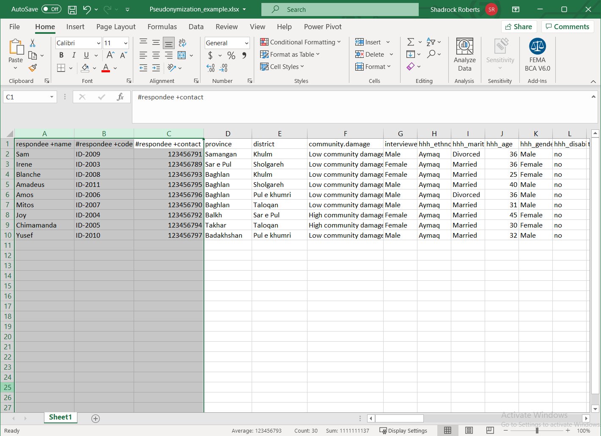

# Псевдонимизация
Это пример одного из способов деидентификации данных в электронной таблице. Существует множество способов деидентификации, и в этом примере используется «код ключа» для удаления личной информации, содержащейся в прямых идентификаторах, и сохранения ее в отдельном файле. Персональные данные, позволяющие идентифицировать личность (PII) — это информация, которая может быть использована для установления личности человека. Типичными примерами являются имя, адрес, номер телефона, дата рождения и номер социального страхования или государственный идентификационный код. В упражнении используется [демонстрационный набор данных, который находится в папке данных онлайн-руководства.](data/Pseudonymization_example.csv).

UПосле псевдонимизации демонстрационного набора данных вы можете продолжить работу с учебным пособием Центра гуманитарных данных [для проведения оценки риска раскрытия информации.](https://centre.humdata.org/learning-path/disclosure-risk-assessment-overview/).

## Шаг 1. Определите PII
Начните с идентификации PII в данных. В идеале у вас должны быть метаданные — данные или документ, определяющий ваши данные, — чтобы помочь вам понять, какие поля содержат PII. В демонстрационных данных есть три столбца, которые содержат потенциальные PII:
- респондент +имя (`#respondee +name`) - содержит имя.
- респондент +код (`#respondee +code`) - вероятно, содержит какой-либо идентификационный код.
- респондент +контакт (`#respondee +contact`) - возможно содержит номер мобильного телефона.

Каждый из этих прямых идентификаторов использует [Гуманитарный язык обмена для маркировки данных](https://hxlstandard.org).

## Шаг 2. Создайте новые столбцы для кода ключа
Мы будем использовать код ключа, значение, которого мы сгенерируем, чтобы раскрыть PII. Поскольку все прямые идентификаторы сгруппированы вместе, мы создадим два новых столбца между столбцами C, #респондент +контакт (`#respondee +contact`) и D, область (`province`). В Excel мы делаем это, выделяя столбец справа от того места, куда мы хотим вставить новые столбцы, щелкаем правой кнопкой мыши на столбце и выбираем Вставить. Повторите этот процесс еще раз, чтобы создать еще один пустой столбец.

## Шаг 3 — Создайте код ключа
Начните с названия новых столбцов. Мы будем использовать «ключевой код» в каждом из них: каждый столбец будет содержать одинаковые значения. Сейчас самое время обновить любые метаданные об этом наборе данных, чтобы объяснить, что означает «код ключа» Далее мы воспользуемся [функцией Excel Автозаполнение](https://support.microsoft.com/en-us/office/fill-data-automatically-in-worksheet-cells-74e31bdd-d993-45da-aa82-35a236c5b5db) для создания простого кода. Введите Респондент01 в первой ячейке. Затем выделите эту ячейку, щелкните указатель перемещения в правом нижнем углу ячейки и перетащите вниз до конца набора данных. Это автоматически заполнит окончательный номер каждой записи, присвоив каждому респонденту новый код.

## Шаг 4. Продублируйте код ключа и удалите формулы
Теперь мы скопируем код ключа и вставим его в соседний столбец. Это можно сделать с помощью основных клавиатурных команд, таких как `ctrl + C` или выделить ячейки, которые нужно скопировать, щелкнуть по ним правой кнопкой мыши и выбрать Копировать. В соседнем столбце выделите ячейки, в которые вы хотите вставить новый код ключа, щелкните правой кнопкой мыши и выберите Вставить. Мы специально выбрали вставить только значения. Если вы использовали формулу для создания нового кода, важно сохранить только значения для использования в качестве кода ключа!

## Шаг 5. Разделите прямые и косвенные идентификаторы
Выделите столбцы, содержащие прямые идентификаторы с PII, вместе с одним из столбцов кода ключа. В этом примере мы выделяем столбцы A-D. Щелкните их правой кнопкой мыши и выберите Вырезать.

Затем откройте новую таблицу и вставьте эти значения с помощью сочетания клавиш `ctrl + v` или другим способом. Сохраните новую таблицу. Теперь у вас есть две таблицы: одна из них содержит косвенные идентификаторы, а новая таблица содержит прямые идентификаторы с PII. Оба набора данных содержат ключевой код для каждой записи в данных, чтобы при необходимости все данные можно было объединить.

## Дальнейшие шаги
Оба файла содержат ключевой код, который позволит их собрать вместе. Один из способов сделать это в Excel — использовать [функцию VLOOKUP](https://support.microsoft.com/en-us/office/vlookup-function-0bbc8083-26fe-4963-8ab8-93a18ad188a1) для автоматического заполнения ячеек на основе значений других ячеек. В этом случае вы можете заполнить пустые ячейки исходного файла отсутствующими идентификационными данными на основе значения ключевого кода.

Поскольку новый файл содержит прямые идентификаторы, содержащие PII, он должен храниться в безопасном месте. Отличный способ сделать это — зашифровать файл и использовать облачное хранилище для ограничения доступа к файлу (см. руководства по Лучшим практикам шифрования и совместного использования файлов).   

**Помните: даже при том, что исходная электронная таблица была деидентифицирована путем удаления прямых идентификаторов, содержащих очевидную PII, другие косвенные идентификаторы могут быть объединены с другими данными или проанализированы таким образом, чтобы можно было идентифицировать человека.** По этой причине оба файла должны храниться в безопасном месте. Если вы хотите предоставить более широкий доступ к исходному файлу, не содержащему PII, крайне важно выполнить оценку риска раскрытия информации, чтобы обеспечить минимальный уровень риска повторной идентификации данных. В Центре гуманитарных данных есть [онлайн-руководство по проведению оценки рисков раскрытия информации](https://centre.humdata.org/learning-path/disclosure-risk-assessment-overview/) с использованием [статистического программного обеспечения с открытым исходным кодом “R”](https://www.r-project.org/). Кроме того, на веб-странице [Poverty Action Lab Деидентификация для публикации данных](https://www.povertyactionlab.org/resource/data-de-identification) содержится отличное обсуждение обезличивания данных и пример кода для [статистического программного обеспечения Stata](https://www.stata.com/). Для внутреннего использования сотрудниками Mercy Corps доступен [Проект руководства от T4D](https://docs.google.com/document/d/1wFI5Ltvu9abtuRDVVZnbY2rdR61N3Eel4egZ02HuvU0/edit?usp=sharing), который содержит дополнительные формулы Excel.

Наконец, все эти шаги вместе помогают снизить риски или раскрытие PII, поэтому они должны быть перечислены в PIA (см. Руководство по оценке влияния на конфиденциальность), чтобы другие понимали, как эти данные защищаются.
