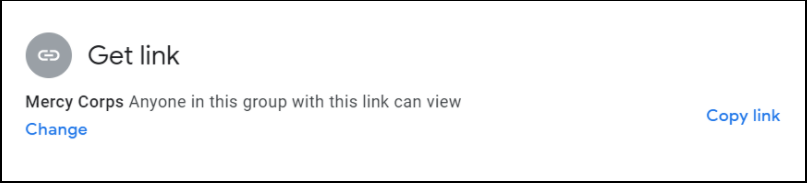

# Спільний доступ до файлів GDrive
Ось приклад використання спільного доступу до файлу на Google Диску із застосуванням найкращих практик. Уявіть, що зараз 2020 рік і Mercy Corps працює з консультантом (PNW Rocks), щоби створити матеріали для великої нової ініціативи в Mercy Corps із кодовою назвою "Шишка". Про проєкт "Шишка" не буде оголошено публічно до липня 2021 року, тому важливо обмежити коло осіб, які мають доступ до файлу. Для початку ми хочемо разом працювати над наступними кроками для проєкту у файлі під назвою "Плани шишки".

## Крок 1 — завантажити
Завантажте файл на Мій диск.

## Крок 2 — поділитися
Щоби надати спільний доступ до файлу, клацніть по ньому правою кнопкою миші та виберіть команду "Поділитися".

  - Надавайте доступ лише тим, кому файл потрібен. Коли ви надаєте спільний доступ до файлу на Моєму диску, за замовчуванням встановлюється "Обмежений доступ" (для осіб і груп), що є найбільш ефективним варіантом. Пам'ятайте, вміст конфіденційної, особистої інформації або інформації, що ідентифікує особу (ІІО) завжди повинен мати обмежений доступ!
  - Параметр "Усі, хто має посилання" повинен використовуватися лише для файлів, які не містять конфіденційної інформації та відкриті для громадськості. Якщо параметр "Усі, хто має посилання"використовується для файлу з конфіденційними особистими, персональними або фінансовими даними, такий файл може легко і випадково стати публічним, поставити Mercy Corps під загрозу безпосереднього юридичного ризику і полегшити небезпечним людям використання інформації в злочинних цілях.

## Крок 3 — обрати рівень доступу
Введіть адресу електронної пошти людини, якій ви хочете надати спільний доступ, а потім виберіть рівень доступу. Google за замовчуванням надає доступ "Редактор", який підходить лише для членів команди, яким потрібен повний доступ до документа. Коли ви залучаєте зацікавлені сторони для зворотного зв'язку, оберіть доступ "Читач" або "Коментатор". Найкраща практика — сповістити особу та додати повідомлення, в якому пояснюється, чому ви надали спільний доступ до цього файлу. Щоби сповістити, поставте відмітку біля "Сповістити". Завершивши зміни, натисніть "Надіслати".

Інший варіант — відправити окремий електронний лист із посиланням на файл. Щоби повідомити окремо електронною поштою, зніміть відмітку біля "Сповістити". Після натискання "Готово"клацніть по файлу правою кнопкою миші та оберіть "Отримати посилання". У новому спливаючому вікні натисніть кнопку "Копіювати посилання", а потім вставте його у свій електронний лист.

- Щоби дізнатися більше про рівні доступу, зайдіть у розділ ["Спільний доступ і співпраця на Моєму диску"](https://support.google.com/a/users/answer/9310248?hl=en).
- Якщо ви обмежите доступ до файлу, а хтось із доступом поділиться посиланням з іншою особою, ця особа не матиме автоматично доступу до цієї інформації на Google Диску. Замість цього вона побачить веб-сторінку, де можна запросити доступ. Запит на доступ надійде власнику файлу. Запити на доступ потрібно переглядати, а ті, хто отримує їх, не повинні надавати дозвіл на будь-які запити, не ознайомившись із вищенаведеними примітками та міркуваннями.

## Крок 4 — тимчасовий доступ
Після надання дозволу термін спільного доступу можна скоротити. Щоб обмежити доступ, клацніть по файлу правою кнопкою миші ще раз і клацніть на "Поділитися". Знайдіть адресу електронної пошти, за якою ви щойно надали спільний доступ, і клацніть правою кнопкою миші на рівень доступу. Ви побачите нові параметри; оберіть "Надати тимчасовий доступ".

З'явиться календар. Перейдіть до місяця, коли термін дії доступу має закінчитися, і оберіть відповідну дату.

Календар зникне, а показана дата зміниться. Побачивши, що дата закінчення терміну доступу правильна, натисніть "Зберегти".

## Крок 5 — додаткові параметри
Якщо у вас є побоювання, що інші можуть вчинити неналежні дії із вмістом, на екрані налаштувань є додаткові параметри. Доступ до параметрів файлу можна отримати через піктограму шестерні у верхньому правому куті вікна спільного доступу. Натисніть на шестерню, і ви побачите варіанти обмеження подальшого спільного використання або вимкнення можливості завантаження, друку або копіювання. Для будь-якої функції, яку ви хочете вимкнути, просто зніміть відмітку. Файл швидко оновиться, зберігши нове налаштування.

- Щоби дізнатися більше, зайдіть у розділ [Можливості обмеження спільного доступу на Диску](https://support.google.com/a/users/answer/9308868?hl=en).

### Додаткові міркування
  - Не розміщуйте конфіденційні файли у папках, які знаходяться у спільному доступі в багатьох людей. Дозволи спільних папок поширюються на кожен файл і вкладену папку, тому доступ до вашого конфіденційного файлу може отримати будь-хто, хто має дозвіл на доступ до головної папки! Замість цього перемістіть конфіденційний файл до нового місця за межами більшої структури спільних папок.
  - Після надання спільного доступу до файлу у вас може бути можливість "Зробити копію" та/або "Перемістити" файл в інше місце. Ніколи не переміщуйте файл без дозволу власника!
  - Якщо вам потрібно переглянути файл на Моєму диску або в іншому місці, найкраще буде використати параметр ["Додати ярлик на Диск"](https://support.google.com/drive/answer/9700156?hl=en&co=GENIE.Platform%3DDesktop).
  - Якщо зроблено копію файлу або файл переміщено, майте на увазі, що він не матиме тих самих дозволів, що й вихідний файл, якщо ви спеціально не встановите ці дозволи.

У цьому посібнику не розглядається спільний доступ до файлів на спільних дисках Google, а також зовнішні платформи спільного доступу до файлів. Щоби більше дізнатися про це, зайдіть на сторінку Google ["Найкращі практики для спільних дисків"](https://support.google.com/a/users/answer/9310352?hl=en) або ["Керування спільними дисками".](https://support.google.com/a/topic/7337266?hl=en&ref_topic=2490075). Кожна з цих сторінок доступна різними мовами: прокрутіть униз сторінки, щоби вибрати свою мову..

Найкращий спосіб контролювати доступ до файлів за допомогою Диска — це створити групу Google і надати дозволи тим, хто входить до неї. Групи Google призначені не лише для надсилання електронних листів; групи є потужним і зручним інструментом для керування дозволами доступу до папок і файлів. [Дізнайтеся більше про Групи Google](https://support.google.com/groups/?hl=en#topic=9216).

Якщо ваш проєкт вимагає використання додатків поза межами G Suite, запропонуйте своій команді завантажити [Google Диск для робочого стола](https://support.google.com/drive/answer/7329379?hl=en). Ця програма дозволяє переглядати будь-які документи на Моєму диску або Спільних дисках так, ніби вони знаходяться на вашому ноутбуці, навіть в автономному режимі й без необхідності завантажувати документ або конвертувати його у формат Google.
